As we continue to add and improve our application, the results of our testing audits will be posted below, as we will continue to thoroughly test all additions to our implementation.

# Audit 1 - Compatability

Through the use of the Bootstrap grid system, we were able to control how different viewport sizes display information. We conducted research into different browser policies regarding the methods we used to display information to ensure it was being displayed to our intentions. To further test this, we were able to use Chrome Dev Tools and rectify any issues we encountered regarding the responsiveness of the site. To represent the three different categories of viewports that may be viewing the site, we will be auditing our site and demonstrate what it looks like for each viewport.

## Dashboard

### Desktop (1920 x 1080)

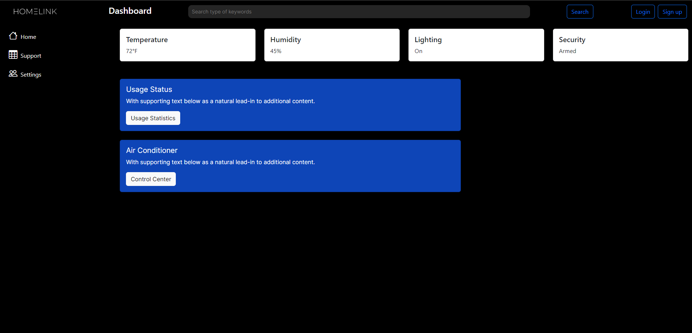

### iPad Pro

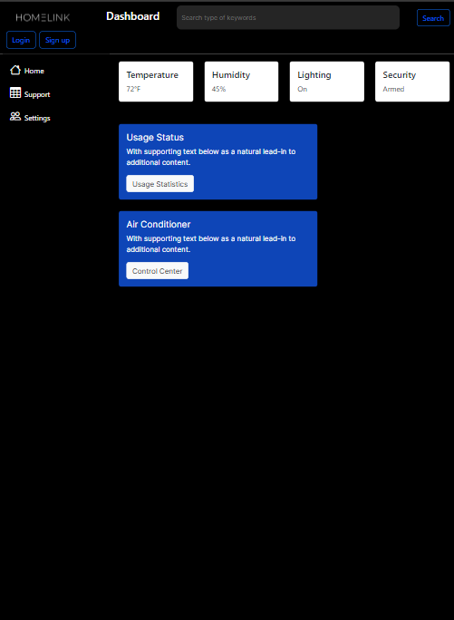

## iPhone 14 Pro Max

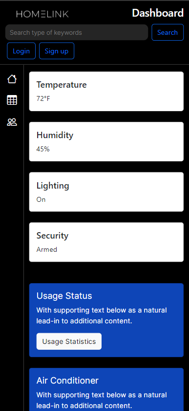

## Settings

### Desktop (1920 x 1080)

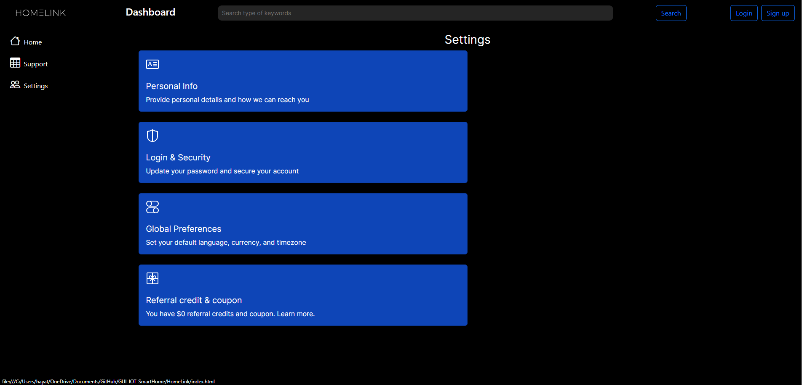

### iPad Pro

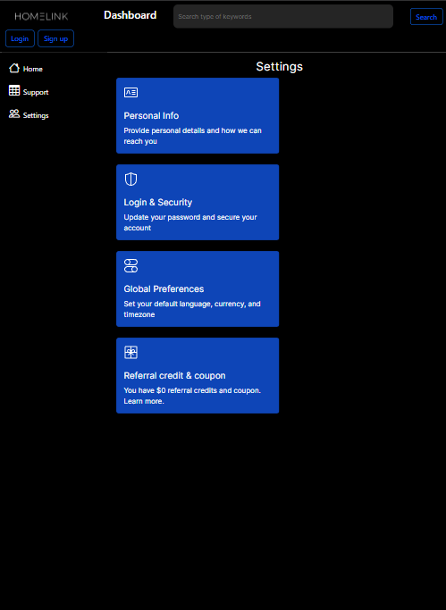

## iPhone 14 Pro Max

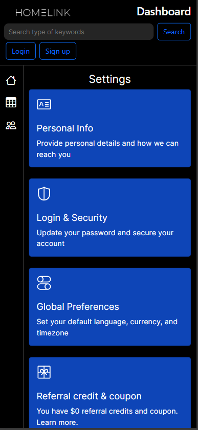

## Support

### Desktop (1920 x 1080)

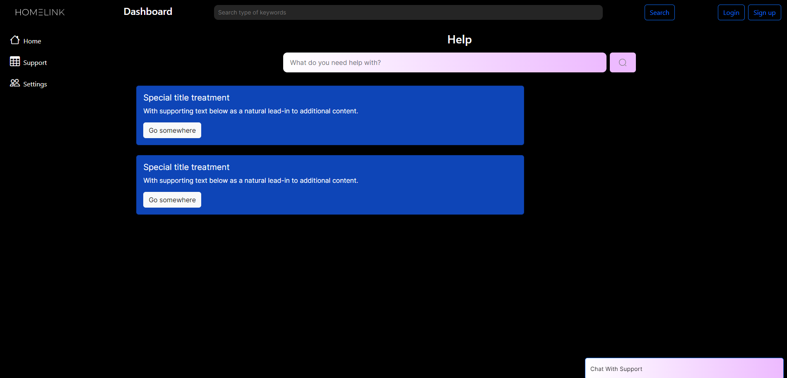

### iPad Pro

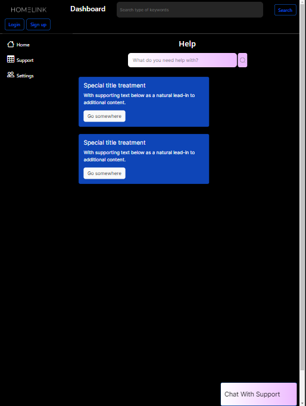

## iPhone 14 Pro Max

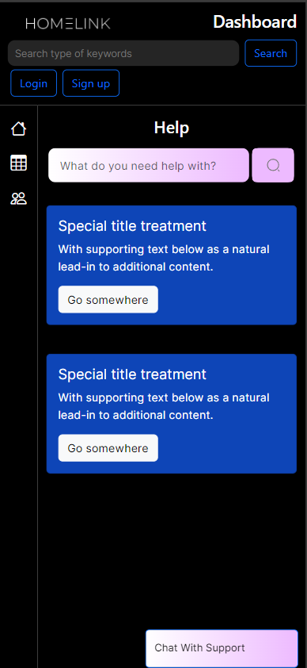

## Login

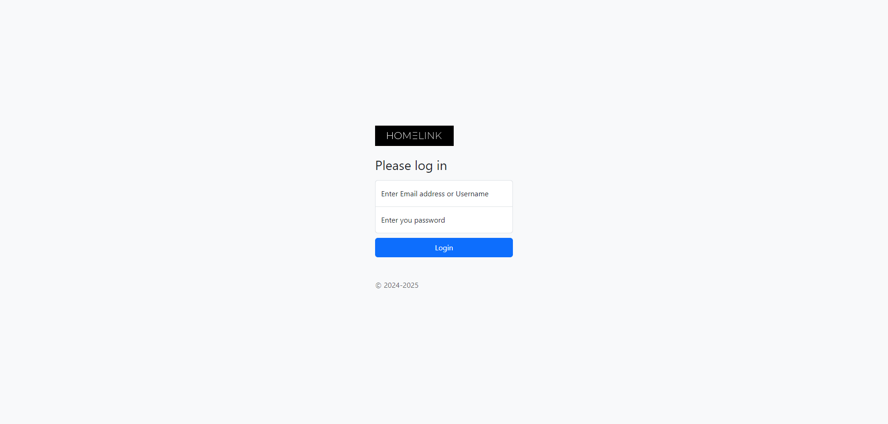

### iPad Pro

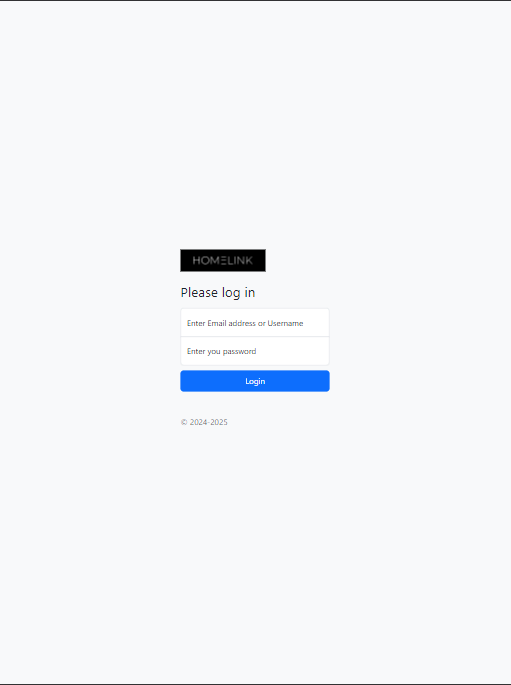

## iPhone 14 Pro Max

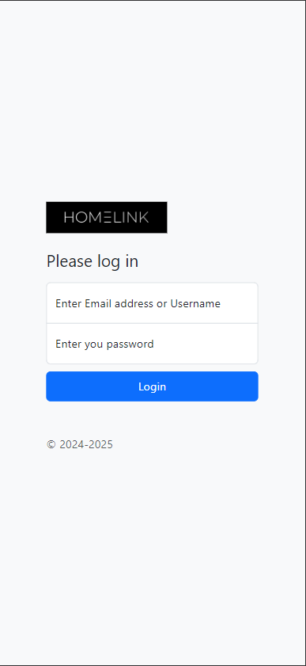

## Sign Up

(All views are nearly identical to above login views)

--- 

This audit is meant to expose surface level issues of our implementation in compatability. Our implementation to this point has been at mostly a design level, and the audit has revealed some common issues. The forefront issue lies with the iPad viewports, as it's clear the font size is not where it should be to have the application be readable and accessible to all viewers. 

